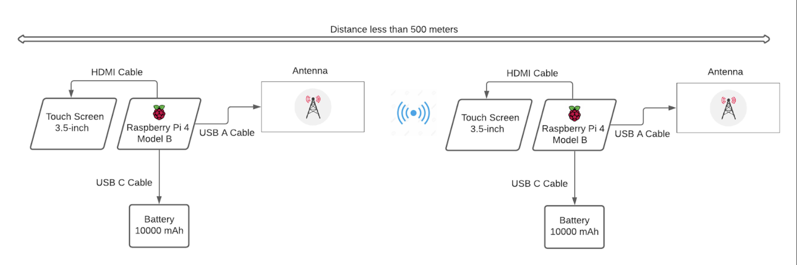
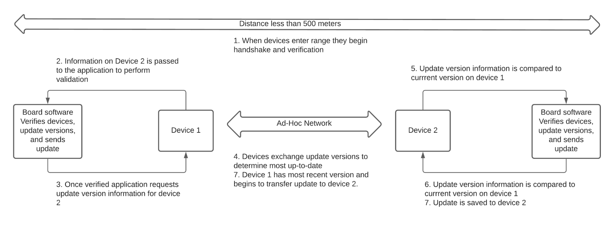

# *v2v_interface*
***

# Vehicle-to-Vehicle Update Delivery System

***This project involves the design and creation of a close-range receptionless Vehicle-to-Vehicle update delivery platform using two Raspberry Pi development boards.***
***

## Installation
Clone this repository to your Raspberry Pi to install v2v_interface.

```bash
git clone https://github.com/capstone-paccar/v2v_interface.git
```
See [SETUP.md](SETUP.md) for setting up Raspberry Pi for Ad-Hoc communication.

## Usage
If you choose not to integrate this program with **~/.bashrc** for automatic run-on-startup, run the following command in the Pi's terminal.

```bash
cd v2v_interface
python3 main.py
```
See [SETUP.md](SETUP.md) for setting up Raspberry Pi for automatic run-on-startup.

## License
TODO: Give the project a license.

## Authors and Acknowledgement
Created by Austin Gilbert, Aashima Mehta, and Cameron Ufland for the *University of Washington, Bothell* in affiliation with *PACCAR Inc*.

Designed for the Electrical Engineering Department's Senior Design Capstone Project under supervision of staff lead Elaine Reeves and industry lead David Sasaki.
***

## Background
Our team has developed a proof of concept for this technology to be used in PACCAR’s fleet of trucks for the delivery of updates in locations with slow internet speeds. Commercial vehicles operate in many different environments and an internet connection may not be available most of the time. Due to this lack of internet connectivity, many commercial vehicles have software that is out of date. This Vehicle-to-Vehicle Update Delivery project will allow trucks to communicate with one another in receptionless areas with many trucks, such as truck stops.

Furthermore, this project implements a mobile application for maintenance technicians to more-easily update trucks in remote locations without nearby trucks. Through these two means of update delivery, our industrial sponsor, PACCAR, can ensure that important safety and general updates can reach more vehicles.

## User Scenarios & Use Cases
This project allows devices to communicate with one another in receptionless areas with many other nearby devices. The main use case is trucks with later versions of updates delivering updates to other trucks with earlier versions at truck stops, lots, and on the road.

Both trucks, once updated, should be able to deliver updates to even more trucks, spreading the latest update files much like the spread of a virus. The following figures illustrate Project A in a diagram and step-by-step process.

*Figure 1: Diagram Illustrating Project*


*Figure 2: Step-by-Step Process*
